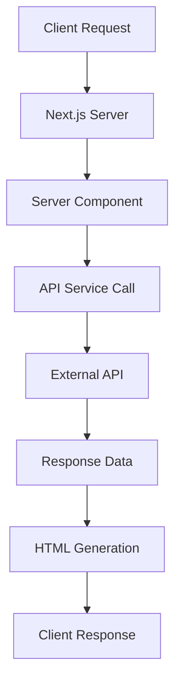

# 🚀 Server-Side Rendering (SSR) Data Fetching Guide

Dokumen ini menjelaskan standar alur fetching data pada STI APPs menggunakan **Server-Side Rendering (SSR)** dengan Next.js App Router untuk optimasi performa dan SEO.

---

## 📋 Overview SSR Architecture

**SSR (Server-Side Rendering)** adalah teknik rendering dimana HTML page di-generate di server sebelum dikirim ke client. Berbeda dengan CSR (Client-Side Rendering) yang me-render komponen di browser menggunakan JavaScript.

### Keuntungan SSR:

- **SEO Friendly**: Search engine dapat membaca content langsung dari HTML
- **Performance**: First contentful paint lebih cepat
- **Accessibility**: Content dapat diakses tanpa JavaScript

### Alur Kerja SSR di STI Apps:



1. **Client Request**: Browser meminta halaman
2. **Server Component**: Next.js menjalankan komponen di server
3. **API Service Call**: Server memanggil API internal
4. **External API**: Mengambil data dari database/service
5. **HTML Generation**: Server membuat HTML lengkap dengan data
6. **Client Response**: Browser menerima HTML yang sudah siap

---

## 1️⃣ **Server Component Structure**

**Server Component** adalah komponen React yang berjalan di server, bukan di browser. Komponen ini dapat melakukan async operations seperti database calls atau API requests secara langsung.

### Basic Server Component Pattern

```typescript
// filepath: app/(root)/page.tsx
const Home = async () => {
  // Data fetching langsung di server component
  const { images, error } = await getHeroSliders();
  const { sambutan, error: sambutanError } = await getSambutan();
  const { programs, error: programError } = await getProgramUnggulan();

  return (
    <div className="min-h-screen bg-white">
      <Suspense fallback={<HeroSkeleton />}>
        <HeroSlider images={images} error={error} />
      </Suspense>
    </div>
  );
};
```

### Key Points:

- ✅ **Async Function**: Server component menggunakan `async` function
- ✅ **Direct API Call**: Data di-fetch langsung tanpa hooks
- ✅ **Error Handling**: Built-in error handling pada setiap fetch
- ✅ **Suspense**: Progressive loading dengan fallback skeleton

---

## 2️⃣ **Data Fetching Functions**

**Data Fetching Functions** adalah fungsi async yang bertanggung jawab mengambil data dari API sebelum komponen di-render. Fungsi ini berjalan di server dan hasilnya akan di-inject ke komponen.

### Perbedaan dengan Client-Side Fetching:

- **Server-Side**: Data sudah tersedia saat HTML di-generate
- **Client-Side**: Data di-fetch setelah komponen di-mount di browser

### Pattern yang Digunakan di STI Apps:

1. **Service Integration**: Menggunakan service layer yang sudah ada
2. **Error Handling**: Selalu return object dengan data dan error
3. **Data Transformation**: Mengubah format API response ke format yang dibutuhkan UI

### Service Integration Pattern

**Service Integration** menggunakan service layer yang sudah dibuat di folder `/api`. Service ini sudah include header configuration, base URL, dan error handling dasar.

```typescript
import {
  HeroSliderSuperAdminService,
  SambutanKaprodiSuperAdminService,
  ProgramUnggulanSuperAdminService,
} from "@/api/superadmin";

async function getHeroSliders() {
  try {
    const response = await HeroSliderSuperAdminService.getHeroSliderList(1, 50);
    const slidersData = response.data?.data || response.data || [];
    const activeSliders = Array.isArray(slidersData)
      ? slidersData.filter((slider: HeroSliderType) => slider.isActive === 1)
      : [];
    return { images: activeSliders, error: null };
  } catch (err) {
    return { images: [], error: "Gagal memuat data hero slider" };
  }
}
```

### Data Transformation Pattern

```typescript
async function getProgramUnggulan() {
  try {
    const response =
      await ProgramUnggulanSuperAdminService.getProgramUnggulanList(1, 10);
    const apiPrograms = response.data?.data || response.data || [];

    const programs = Array.isArray(apiPrograms)
      ? apiPrograms.map((item: any) => ({
          ...item,
          image: item.image,
          shortDesc: item.short_desc,
          applicationDeadline: item.application_deadline,
          applicationLink: item.application_link,
          benefits: item.program_benefits?.map((b: any) => b.benefit) || [],
          requirements:
            item.program_requirements?.map((r: any) => r.requirement) || [],
        }))
      : [];
    return { programs, error: null };
  } catch (err) {
    return { programs: [], error: "Gagal memuat data program unggulan" };
  }
}
```

---

## 3️⃣ **Component Architecture Pattern**

**Component Architecture Pattern** dalam SSR menggunakan pendekatan **Server-Client Split**, dimana kita memisahkan logic yang berjalan di server dan yang berjalan di client.

### Konsep Server-Client Split:

- **Server Component**: Handle data fetching, business logic, dan initial rendering
- **Client Component**: Handle interactivity, state management, dan user interactions

### Keuntungan Pattern Ini:

1. **Performance**: Server component tidak mengirim JavaScript ke client
2. **SEO**: Content sudah ter-render di server
3. **Progressive Enhancement**: Client component menambah interactivity
4. **Code Splitting**: Automatic optimization oleh Next.js

### Implementasi di STI Apps:

Contoh implementasi pada Hero Slider dimana server component handle data dan fallback, sedangkan client component handle carousel logic dan animations.

### Server-Client Component Split

**Server Component** (`hero-slider.tsx`) bertanggung jawab untuk:

- Menerima props data dari parent server component
- Handle error states dan loading states
- Provide fallback data untuk development
- Pass clean data ke client component

```typescript
// Server Component (hero-slider.tsx)
import type { HeroSlider } from "@/types/admin/landing-page/hero-slider/hero-slider";
import HeroSliderClient from "./hero-slider-client";
import ErrorState from "../../error-state";

export const revalidate = 86400; // ISR: 1 hari

export default function HeroSlider({ images, error }: Props) {
  if (error) {
    return <ErrorState title="Gagal Memuat Hero Slider" />;
  }

  // Fallback data untuk development
  const fallback = [
    {
      id: 1,
      title: "Bengkel Koding",
      subtitle: "Magang MBKM Internal",
      image: "/assets/landingpage/img/slideshow-new/slideshow-bengkod.webp",
      isActive: 1,
    },
  ];

  return <HeroSliderClient images={images.length > 0 ? images : fallback} />;
}
```

```typescript
// Client Component (hero-slider-client.tsx)
"use client";

import { useState, useEffect } from "react";

export default function HeroSliderClient({ images }: Props) {
  const [currentImage, setCurrentImage] = useState(0);

  useEffect(() => {
    const interval = setInterval(() => {
      setCurrentImage((prev) => (prev + 1) % images.length);
    }, 4000);
    return () => clearInterval(interval);
  }, [images.length]);

  return <section>{/* Interactive UI Components */}</section>;
}
```

---

## 4️⃣ **Error Handling & Fallbacks**

**Error Handling** dalam SSR sangat penting karena error yang terjadi di server dapat memblokir entire page render. Kita perlu implement **graceful degradation** dimana aplikasi tetap berjalan meski ada error.

### Konsep Graceful Error Handling:

1. **Never Throw**: Jangan biarkan error di-throw sampai ke komponen
2. **Always Return**: Selalu return object dengan data dan error state
3. **Fallback Ready**: Sediakan fallback data untuk setiap kemungkinan error
4. **User Friendly**: Error message yang bisa dipahami user

### Strategy Error Handling di STI Apps:

- **Service Level**: Catch error di service call dan return normalized response
- **Component Level**: Handle error state dengan UI yang appropriate
- **Fallback Data**: Provide static data untuk development dan emergency

### Graceful Error Handling

**Service Level Error Handling** memastikan bahwa function selalu return object dengan struktur yang konsisten, tidak peduli success atau error.

```typescript
async function getHeroSliders() {
  try {
    const response = await HeroSliderSuperAdminService.getHeroSliderList(1, 50);
    // Data processing...
    return { images: activeSliders, error: null };
  } catch (err) {
    console.error("Hero slider fetch error:", err);
    return {
      images: [],
      error: "Gagal memuat data hero slider",
    };
  }
}
```

### Component Error States

```typescript
export default function HeroSlider({ images, error }: Props) {
  if (error) {
    return (
      <ErrorState
        title="Gagal Memuat Hero Slider"
        description="Terjadi kesalahan saat memuat data hero slider."
      />
    );
  }

  // Fallback untuk data kosong
  const displayImages = images.length > 0 ? images : fallbackData;

  return <HeroSliderClient images={displayImages} />;
}
```

---

## 5️⃣ **Performance Optimization**

**Performance Optimization** dalam SSR fokus pada mengurangi server load dan mempercepat response time. Next.js menyediakan beberapa strategi caching dan rendering.

### Strategi Optimization yang Digunakan:

1. **ISR (Incremental Static Regeneration)**: Cache hasil render dengan revalidation otomatis
2. **Suspense Boundary**: Loading states yang tidak memblokir render
3. **Component Splitting**: Pisahkan heavy computation ke client component

### ISR vs SSR vs SSG:

- **SSR**: Render setiap request (slow, always fresh)
- **SSG**: Render saat build time (fast, static content)
- **ISR**: Render + cache + revalidate (fast, dynamic content)

### ISR (Incremental Static Regeneration)

**ISR** adalah teknik dimana page di-render di server, di-cache, kemudian di-revalidate sesuai interval yang ditentukan. Ini memberikan balance antara performance dan data freshness.

```typescript
// Revalidate setiap 24 jam
export const revalidate = 86400;

// Atau dynamic revalidation
export const revalidate = 3600; // 1 jam
export const dynamic = "force-dynamic"; // Always server-render
```

### Suspense & Skeleton Loading

```typescript
<Suspense fallback={<HeroSkeleton />}>
  <HeroSlider images={images} error={error} />
</Suspense>

<Suspense fallback={<ProgramUnggulanSkeleton />}>
  <ProgramUnggulanSection programs={programs} error={programError} />
</Suspense>
```

---

## 6️⃣ **Type Safety**

**Type Safety** dalam SSR memastikan bahwa data yang di-pass dari server ke client component memiliki type yang konsisten dan predictable. Ini mencegah runtime errors dan meningkatkan developer experience.

### Keuntungan TypeScript dalam SSR:

1. **Compile Time Checking**: Error detection sebelum production
2. **IntelliSense**: Autocomplete untuk props dan data structure
3. **Refactoring Safety**: Automatic updates saat type berubah
4. **Documentation**: Type sebagai living documentation

### Type Strategy di STI Apps:

- **API Response Types**: Define type untuk setiap API response
- **Component Props Types**: Strict typing untuk props
- **Transformation Types**: Type untuk data yang sudah di-transform

### TypeScript Integration

**API Response Types** didefinisikan berdasarkan struktur data yang diterima dari backend API. Type ini memastikan consistency antara frontend dan backend.

```typescript
// types/admin/landing-page/hero-slider/hero-slider.ts
export type HeroSlider = {
  id?: number;
  image: string;
  title: string;
  subtitle: string;
  imageFile?: File;
  isActive?: number; // 0 = tidak aktif, 1 = aktif
};
```

```typescript
// Component props typing
type Props = {
  images: HeroSlider[];
  error?: string | null;
};
```

---

## 7️⃣ **Best Practices**

**Best Practices** adalah kumpulan pedoman yang telah terbukti efektif dalam implementasi SSR di production. Practices ini berdasarkan experience dan lessons learned dari development STI Apps.

### Filosofi Best Practices di STI Apps:

1. **Separation of Concerns**: Setiap komponen punya tanggung jawab yang jelas
2. **Fail-Safe Design**: Aplikasi tetap berjalan meski ada error
3. **Developer Experience**: Code mudah dipahami dan di-maintain
4. **Performance First**: Setiap decision harus mempertimbangkan performance impact

### Implementation Guidelines:

- **Server Components**: Untuk data fetching dan business logic
- **Client Components**: Untuk interactivity dan state management
- **Error Boundaries**: Untuk graceful error handling
- **Type Safety**: Untuk predictable data flow

### ✅ Do's

**Practices yang harus diterapkan** untuk memastikan code quality dan maintainability:

- **Separate Concerns**: Pisahkan server dan client components
- **Error Boundaries**: Implement error handling di setiap fetch
- **Fallback Data**: Sediakan fallback untuk development
- **Type Safety**: Gunakan TypeScript untuk semua props
- **ISR Strategy**: Gunakan revalidation yang appropriate
- **Suspense**: Implement progressive loading

### ❌ Don'ts

- **Mixing Patterns**: Jangan campurkan SSR dengan SWR di same component
- **Heavy Client Logic**: Jangan taruh business logic di client component
- **Missing Fallbacks**: Selalu sediakan fallback untuk error states
- **Blocking Renders**: Hindari sequential fetching yang tidak perlu

---

## 8️⃣ **Comparison: SSR vs CSR**

**Pemahaman perbedaan SSR dan CSR** penting untuk menentukan strategy yang tepat untuk setiap use case. Tidak semua page cocok dengan SSR, dan tidak semua page cocok dengan CSR.

### Kapan Menggunakan SSR:

- **Landing Pages**: Butuh SEO dan fast initial load
- **Content Heavy**: Blog, artikel, dokumentasi
- **Marketing Pages**: Product pages, company profile
- **Public Pages**: Yang perlu di-index search engine

### Kapan Menggunakan CSR:

- **Dashboard**: Heavy user interaction
- **Admin Panel**: Real-time updates
- **Interactive Apps**: Games, tools, calculators
- **Private Pages**: Yang tidak butuh SEO

### Detailed Comparison:

| Aspect          | SSR (Server-Side)           | CSR (Client-Side)            |
| --------------- | --------------------------- | ---------------------------- |
| **Rendering**   | Server → HTML               | Browser → JavaScript         |
| **SEO**         | ✅ Excellent                | ⚠️ Limited                   |
| **Performance** | ✅ Fast Initial Load        | ⚠️ Slower Initial            |
| **Hydration**   | ✅ Progressive              | ❌ Full Re-render            |
| **Caching**     | ✅ ISR Support              | ✅ SWR Cache                 |
| **Real-time**   | ❌ Limited                  | ✅ Excellent                 |
| **Use Case**    | Landing Pages, SEO Critical | Dashboards, Interactive Apps |

### Praktik di STI Apps:

- **Landing Page**: Menggunakan SSR untuk SEO dan performance
- **Dashboard Mahasiswa**: Menggunakan CSR untuk real-time updates
- **Admin Panel**: Hybrid approach sesuai kebutuhan fitur

---

## 9️⃣ **Migration Tips**

**Migration dari CSR ke SSR** memerlukan pemahaman tentang perbedaan fundamental antara kedua approach. Migration ini tidak selalu straightforward dan perlu planning yang matang.

### Considerations Sebelum Migration:

1. **Use Case Analysis**: Apakah page butuh SSR benefits?
2. **Data Dependencies**: Bagaimana data flow saat ini?
3. **State Management**: State mana yang bisa dipindah ke server?
4. **Performance Impact**: Apakah migration akan improve performance?

### Migration Strategy di STI Apps:

- **Gradual Migration**: Migrate page by page, bukan sekaligus
- **Hybrid Approach**: Kombinasi SSR dan CSR sesuai kebutuhan
- **Fallback Mechanism**: Maintain CSR sebagai fallback

### From CSR to SSR

**Step-by-step migration** dari client-side fetching ke server-side fetching:

```typescript
// Before (CSR with SWR)
const { data, error, isLoading } = useSWR("hero-slider", () =>
  HeroSliderService.getList()
);

// After (SSR)
const Home = async () => {
  const { images, error } = await getHeroSliders();
  return <HeroSlider images={images} error={error} />;
};
```

### Hybrid Approach

```typescript
// SSR for initial data
const Home = async () => {
  const initialData = await getHeroSliders();

  return (
    <div>
      {/* SSR component */}
      <HeroSlider images={initialData.images} />

      {/* CSR component untuk interactivity */}
      <InteractiveSection />
    </div>
  );
};
```

---

## 📚 **Additional Resources**

### Internal Documentation:

- [Client-Side Rendering Guide](./fetching.md)
- [Coding Standard](./coding-standards.md)
